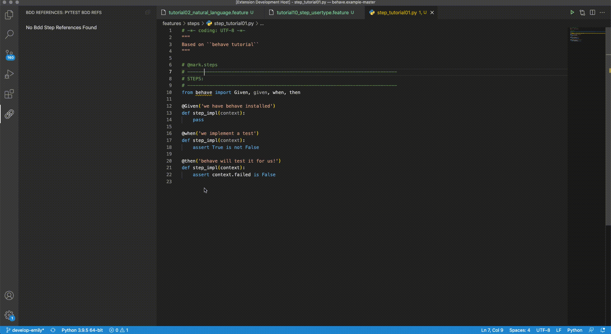

# cucumber-reference-support README

Before we start, I would like to thank the author of [Pytest BDD](https://gitlab.com/vtenentes/pytest-bdd), this whold project is based on his work.

## Features

- Redirecting from the step definition function to all the feature bdd step(right click, Find All Behave References)

For example if there is an image subfolder under your extension project workspace:

## Requirements

- Python (ms-python.python) addon installed
- Recommends
    - the extension only support [Behave](https://behave.readthedocs.io/en/stable/), other library for BDD test is not guaranteed.
    - you may install [Cucumber (Gherkin) Full Support](https://marketplace.visualstudio.com/items?itemName=alexkrechik.cucumberautocomplete) first. It's a powerful and compatible extension.

## Release Notes

### 0.0.1

Initial release of cucumber-reference-support

